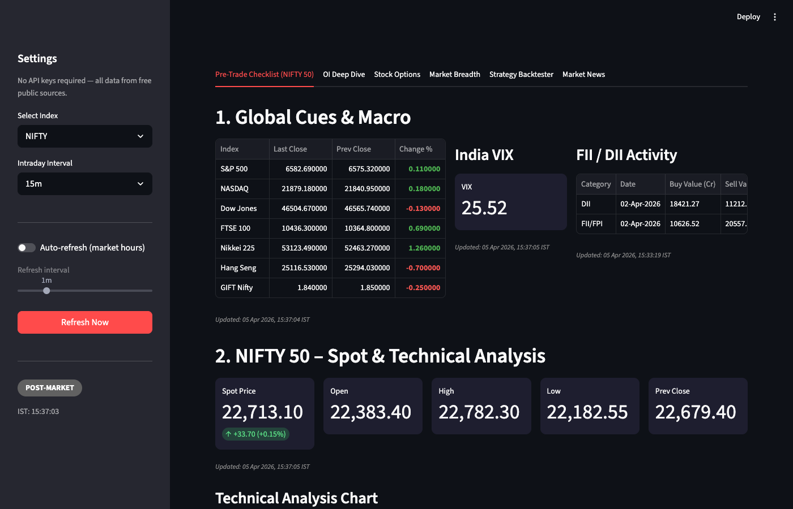
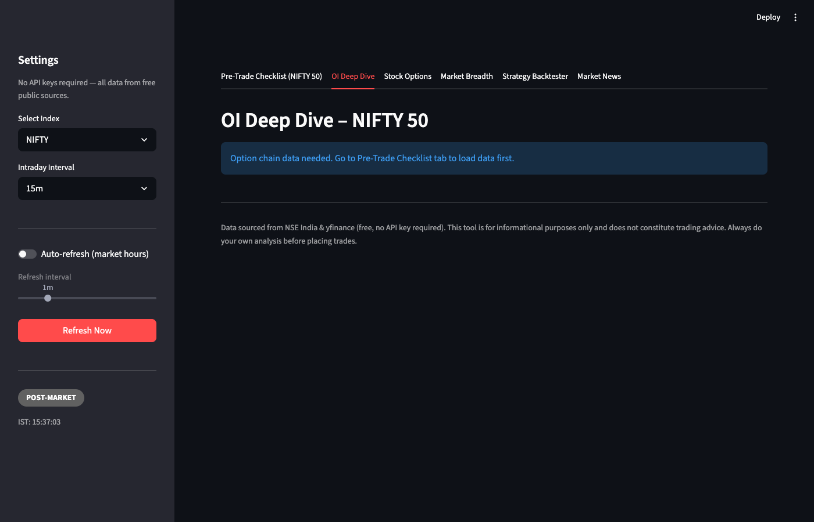
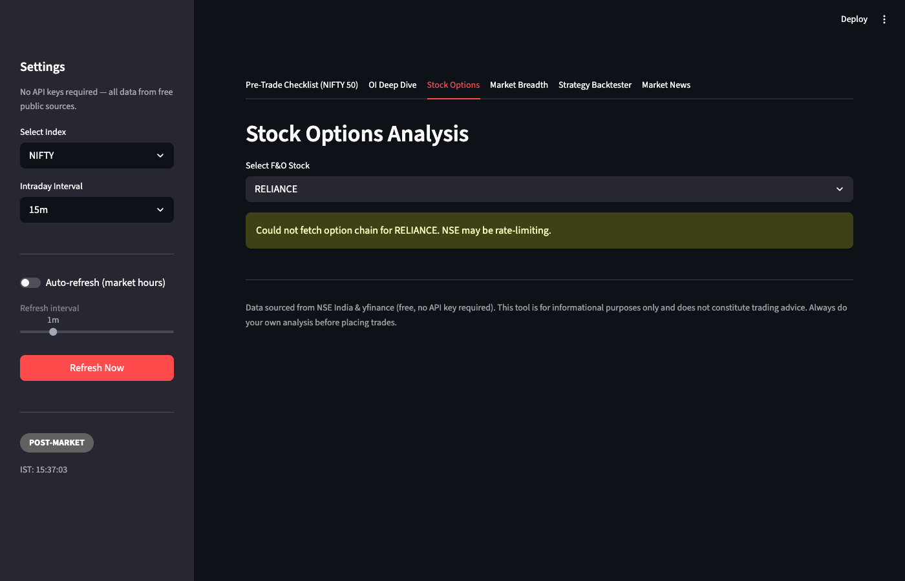
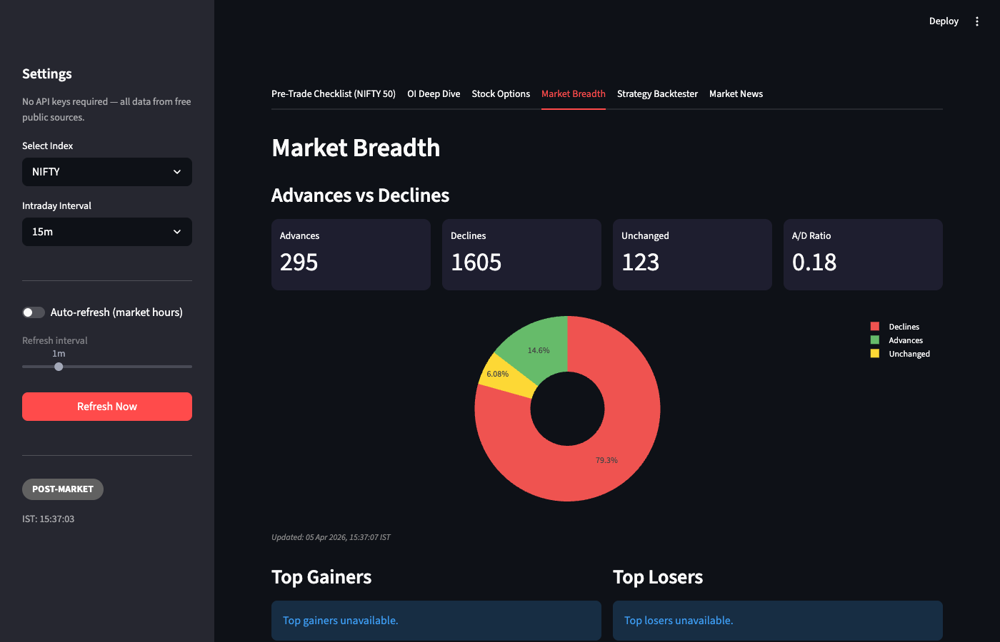
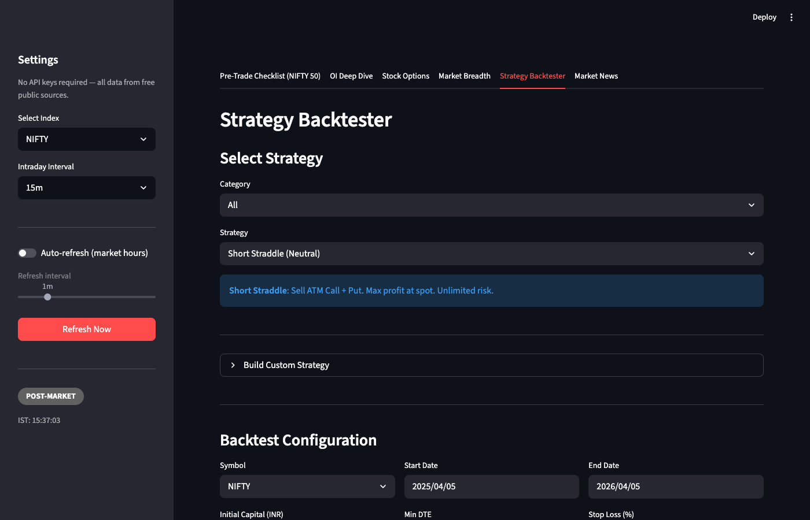
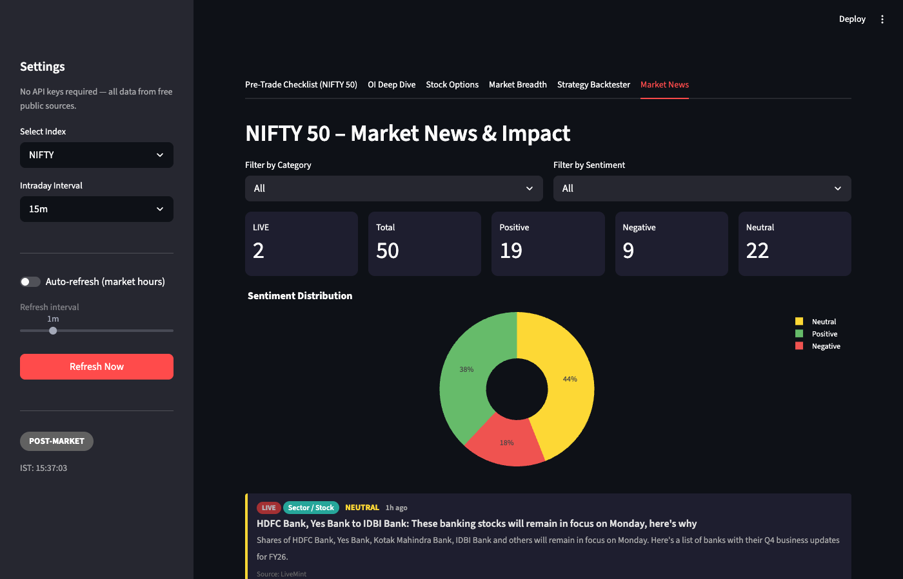

# Indian Index Options Pre-Trade Checklist (No Auth)

A comprehensive Streamlit-based web application for Indian options trading analysis. Automatically gathers and visualizes global cues, technical indicators, options chain data, market breadth, market news with sentiment analysis, and includes a full strategy backtester -- all using **free public APIs** with no broker account or API keys required.

## Screenshots

### Pre-Trade Checklist
Global cues, India VIX, FII/DII activity, spot price, technical indicators, and a 10-point weighted checklist.



### OI Deep Dive
Detailed open interest analysis with PCR, max pain, OI distribution charts, and IV smile.



### Stock Options
Individual F&O stock option chain analysis with all available strikes.



### Market Breadth
Advances vs declines, A/D ratio, sector-wise breadth with donut chart visualization.



### Strategy Backtester
Backtest options strategies (Short Straddle, Iron Condor, Bull Call Spread, etc.) against real NSE bhavcopy data with auto-download.



### Market News & Impact
Live market news aggregation with sentiment analysis (Positive/Negative/Neutral) and filtering.



## Data Sources (Free, Zero Auth)

| Data | Source | Notes |
|---|---|---|
| Global Indices (S&P 500, NASDAQ, etc.) | yfinance | Overnight closes |
| GIFT Nifty | yfinance | Pre-market indicator |
| India VIX | yfinance | Option premium volatility |
| Spot Price & Historical Candles | yfinance | NIFTY, BANKNIFTY, FINNIFTY |
| Option Chain (OI, IV, Greeks) | NSE India API | Full chain with all strikes |
| FII / DII Activity | NSE India API | Cash market activity |
| F&O Bhavcopy (for backtesting) | NSE Archives | Auto-downloaded, dual-format support |
| Market News & Sentiment | Google News RSS | Keyword-based, free |

## Features

### Tab 1: Pre-Trade Checklist

#### Global Cues & Macro
- Global indices with overnight change %
- India VIX with threshold-based signalling
- FII/DII net buy/sell activity

#### Technical Analysis
- Spot Price with OHLC and % change
- Moving Averages: 9, 20, 50, 200 EMA with above/below positioning
- Momentum: RSI (14), MACD with histogram
- Classic Pivot Points (PP, R1-R3, S1-S3)
- Fibonacci Retracement (auto swing high/low)
- Interactive intraday candlestick chart (5m / 15m / 30m / 60m)

#### Options Chain Analysis (via NSE)
- **PCR** (Put-Call Ratio) by OI and Volume
- **Max Pain** strike calculation
- **Highest Call OI** (Resistance) & **Highest Put OI** (Support)
- **OI Buildup** analysis (where new OI is being created)
- **ATM Straddle** price with expected move % and range
- **IV Smile** chart across strikes
- **OI Distribution** & OI Change bar charts

#### Pre-Trade Checklist Summary
- 10-point weighted checklist: each indicator scored BULLISH / BEARISH / NEUTRAL
- Overall bias score (-100% to +100%) with color-coded gauge
- Graceful degradation: if NSE is unavailable, yfinance data still shows

### Tab 2: OI Deep Dive
- Deep open interest analysis for the selected index
- Strike-wise OI distribution and OI change visualization
- Requires option chain data loaded from Tab 1

### Tab 3: Stock Options
- Individual F&O stock option chain analysis
- Select from all NSE F&O stocks (RELIANCE, TCS, INFY, etc.)
- Full chain with all available strikes, IV, OI data

### Tab 4: Market Breadth
- **Advances vs Declines** with count metrics and A/D ratio
- Donut chart visualization of market breadth
- **Top Gainers** and **Top Losers** tables

### Tab 5: Strategy Backtester
- **15+ pre-built strategies** across categories:
  - *Neutral*: Short Straddle, Short Strangle, Iron Butterfly, Iron Condor
  - *Bullish*: Long Call, Bull Call Spread, Bull Put Spread
  - *Bearish*: Long Put, Bear Put Spread, Bear Call Spread
  - *Volatility*: Long Straddle, Long Strangle
  - *Smart Money*: OI-Based Directional, PCR Reversal
  - *Price Action*: Breakout Momentum, Mean Reversion
- **Custom strategy builder** with multi-leg support
- **Auto-download** of NSE bhavcopy data (dual-format: old + new NSE archives)
- **Data management** expander for downloading/cleaning bhavcopy files
- Real P&L calculations with configurable:
  - Symbol, date range, initial capital
  - Min DTE, stop loss %, position sizing

### Tab 6: Market News & Impact
- Live news aggregation from Google News RSS
- **Sentiment analysis** (Positive / Negative / Neutral) for each article
- Filter by **category** (Macro, Sector/Stock, Policy, etc.) and **sentiment**
- Sentiment distribution donut chart
- LIVE badge for recent articles

### UX Enhancements
- **Market Phase Indicator**: PRE-MARKET / MARKET OPEN / POST-MARKET badge
- **Data Freshness Timestamps**: each section shows when data was last fetched
- **No Authentication Required**: just run and use
- **Robust NSE Client**: automatic cookie management, exponential backoff, session refresh
- **Auto Data Cleanup**: bhavcopy files unused for 30+ days are automatically deleted on startup

## Setup

### Prerequisites
- Python 3.10 - 3.13 (recommended: 3.12)

### Installation

```bash
cd indian-options-checklist-no-auth

# Create virtual environment (using uv -- recommended)
uv venv --python 3.12 .venv
source .venv/bin/activate

# Install dependencies
uv pip install -r requirements.txt
```

### Running the App

```bash
streamlit run app.py
```

Opens at `http://localhost:8501`. No credentials needed -- select an index and start analyzing.

## Project Structure

```
indian-options-checklist-no-auth/
├── app.py                      # Streamlit dashboard (UI + layout, 6 tabs)
├── config.py                   # Index definitions, NSE endpoints, TA parameters
├── nse_client.py               # Robust NSE session manager (cookies, retries, backoff)
├── data_fetcher.py             # yfinance + NSE data fetching functions
├── analysis.py                 # Technical indicators, options analytics, signal engine
├── market_data.py              # Market breadth & news data fetching
├── oi_tracker.py               # Open interest deep dive analytics
├── data_downloader.py          # Auto-download NSE bhavcopy (dual-format: old + new)
├── data_cleaner.py             # Cleanup unused bhavcopy files (30-day TTL)
├── backtester/                 # Strategy backtesting engine
│   ├── __init__.py
│   ├── engine.py               # Core backtesting logic & P&L calculation
│   ├── strategies.py           # Pre-built option strategies (15+)
│   ├── smart_money.py          # OI-based & PCR reversal strategies
│   ├── price_action.py         # Breakout & mean reversion strategies
│   ├── custom_strategy.py      # Custom multi-leg strategy builder
│   └── data_adapter.py         # Bhavcopy format adapter (old + new NSE CSV)
├── bhavcopy/                   # Downloaded bhavcopy files (auto-managed)
├── screenshots/                # App screenshots for README
├── requirements.txt            # Python dependencies
├── .gitignore
└── README.md
```

## Architecture

```
┌─────────────┐    ┌──────────────┐    ┌──────────────────────────────┐
│  yfinance    │    │  NSE India   │    │       Streamlit Dashboard    │
│  (Global,    │───>│  (Option     │───>│           (app.py)           │
│   Spot, VIX) │    │   Chain,     │    │                              │
└─────────────┘    │   FII/DII)   │    │  Tab 1: Pre-Trade Checklist  │
                   └──────┬───────┘    │  Tab 2: OI Deep Dive         │
                          │            │  Tab 3: Stock Options         │
┌─────────────┐    ┌──────v───────┐    │  Tab 4: Market Breadth       │
│ Google News  │───>│ nse_client.py│    │  Tab 5: Strategy Backtester  │
│ RSS          │    │ (Session,    │    │  Tab 6: Market News          │
└─────────────┘    │  Cookies,    │    └──────────────┬───────────────┘
                   │  Backoff)    │                   │
┌─────────────┐    └──────────────┘           ┌──────v───────┐
│ NSE Archives │                              │ analysis.py  │
│ (Bhavcopy    │──> data_downloader.py ──>    │ backtester/  │
│  CSV files)  │    data_adapter.py           │ market_data  │
└─────────────┘                               └──────────────┘
```

## Backtester: Bhavcopy Data

The backtester uses NSE F&O bhavcopy CSV files for historical options data. Data is automatically downloaded from NSE archives when you run a backtest.

### Data Sources (in priority order)
1. **NSE New Format** (`nsearchives.nseindia.com`) -- works for 2024 onwards
2. **NSE Old Format** (`archives.nseindia.com`) -- works up to July 2024
3. **jugaad-data** package (if installed) -- Python package fallback

### Auto-Download
When running a backtest, missing bhavcopy files are automatically downloaded for each trading day in the date range. Downloaded files are cached in the `bhavcopy/` directory.

### Data Cleanup
On app startup, bhavcopy files that haven't been accessed for 30+ days are automatically deleted to save disk space. Access tracking is stored in `bhavcopy_access.json`.

## Usage Notes

- **Best during market hours** (9:15 AM - 3:30 PM IST) for real-time NSE data
- **NSE rate limits**: The app caches aggressively (60-300s TTL) to avoid blocks
- **If NSE blocks**: Click "Refresh All Data" after a few seconds; the client auto-refreshes cookies
- **Graceful degradation**: If NSE is down, yfinance sections still work normally
- **Backtester**: For best results, use date ranges within 2024-present (new NSE format) or pre-July 2024 (old format)

## Disclaimer

This tool is for **informational and educational purposes only**. It does not constitute financial advice. Always do your own analysis before making trading decisions.
